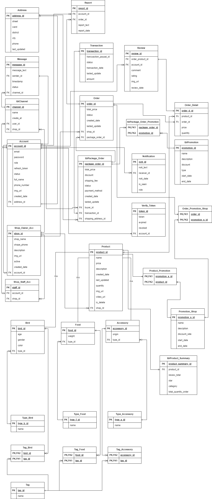
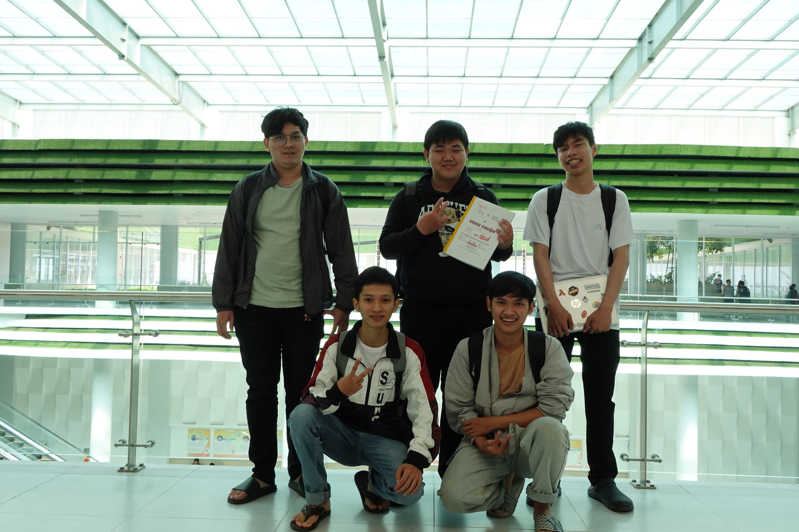

# Backend Bird Trading Project

This project is the backend implementation of a bird trading platform. It provides the necessary APIs and functionalities to support bird trading operations. The backend is developed using Spring Boot, MySQL for data storage, AWS for cloud services, and includes basic CI/CD (Continuous Integration/Continuous Deployment) capabilities. The project also integrates MySQL as the database management system. The application incorporates security features, including JWT (JSON Web Token) and OAuth2 for Google login.
## Features

- User Management: Allows users to register, log in, and manage their accounts.
- Bird Listings: Enables users to create, view, update, and delete bird listings.
- Search and Filtering: Provides search and filtering options to find specific bird listings based on various criteria.
- Image Storage: Allows users to upload and store bird images securely.
- AWS Integration: Utilizes AWS services for cloud storage and deployment.
- Basic CI/CD: Includes basic Continuous Integration and Continuous Deployment capabilities to automate the build and deployment processes.

## Technologies Used

The project incorporates the following technologies:

- Spring Boot: A Java framework used for building robust and scalable backend applications.
- MySQL: A popular relational database management system used for data storage and retrieval.
- AWS: Amazon Web Services provides various cloud services utilized for storage, deployment, and other functionalities.
- CI/CD: Basic Continuous Integration and Continuous Deployment practices are implemented to automate build and deployment processes.

## Installation and Setup

To set up the project locally, follow these steps:

Clone the repository: git clone [<repository-url>](https://github.com/kidhood/bird-trading-platform-backend.git)
Navigate to the project directory: cd backend-bird-trading-project
Install the required dependencies using Maven: mvn install
Set up a MySQL database and configure the connection details in the project's configuration files.
Set up AWS services and configure the necessary credentials and permissions.
Modify the CI/CD configuration files based on your deployment requirements.
Start the application: mvn spring-boot:run
The backend application will start running on the specified port, and you can access it via the provided API endpoints.

## Database Design
The physical ERD illustrates the structure of the database tables and their relationships in the bird trading project. It represents the entities, their attributes, and the relationships between them.
Here is our physical ERD (Entity-Relationship Diagram):

## CI/CD using GitHub Actions and Ansible

This backend project incorporates Continuous Integration (CI) and Continuous Deployment (CD) processes to ensure code quality and automate the deployment process. GitHub Actions is used for CI, while Ansible handles CD.

### Continuous Integration (CI)

The CI process in this project follows these steps:

1. When changes are pushed to the repository, a GitHub Actions workflow is triggered.

2. The workflow initiates the build process using Maven or a similar build tool, generating the application artifact.

3. Automated tests are executed to validate the functionality and integrity of the backend code.

4. Additional code quality checks, such as static code analysis and coding standards, may be performed.

5. Detailed reports on build status, test results, and code quality metrics are generated.

### Continuous Deployment (CD)

The CD process in this project is implemented using Ansible:

1. Ansible playbooks and inventory files define the deployment configuration, including the target environment and server details.

2. After a successful CI build, the CD pipeline is triggered.

3. Ansible connects to the target servers and deploys the application artifact to the specified location.

4. Provisioning and configuration tasks, such as installing dependencies and setting up environment variables, can be automated using Ansible.

5. Rollbacks and health checks ensure successful deployments and monitor the application's health.

6. Reports and notifications provide insights into the deployment status for tracking progress and success.

## Contributing

This project was created by kidhood (Nguyễn Văn Thống), 
hoangtien2911 (Phạm Hoàng Tiến), thuanisuka. Contributions to the project are welcome. Feel free to submit bug reports, feature requests, or pull requests to enhance the functionality of the backend bird trading project.
  

