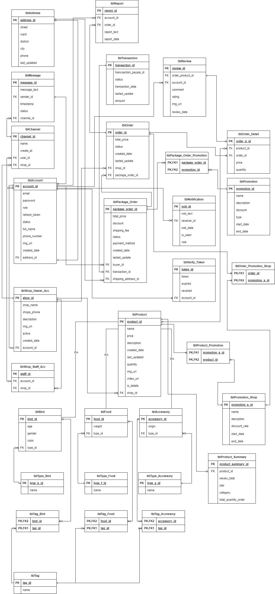

# Backend Bird Trading Project

This project is the backend implementation of a bird trading platform. It provides the necessary APIs and functionalities to support bird trading operations. The backend is developed using Spring Boot, MySQL for data storage, AWS for cloud services, and includes basic CI/CD (Continuous Integration/Continuous Deployment) capabilities. The project also includes a design for the image database to handle bird images.
## Features

- User Management: Allows users to register, log in, and manage their accounts.
- Bird Listings: Enables users to create, view, update, and delete bird listings.
- Search and Filtering: Provides search and filtering options to find specific bird listings based on various criteria.
- Image Storage: Allows users to upload and store bird images securely.
- AWS Integration: Utilizes AWS services for cloud storage and deployment.
- Basic CI/CD: Includes basic Continuous Integration and Continuous Deployment capabilities to automate the build and deployment processes.

## Technologies Used

The project incorporates the following technologies:

- Spring Boot: A Java framework used for building robust and scalable backend applications.
- MySQL: A popular relational database management system used for data storage and retrieval.
- AWS: Amazon Web Services provides various cloud services utilized for storage, deployment, and other functionalities.
- CI/CD: Basic Continuous Integration and Continuous Deployment practices are implemented to automate build and deployment processes.
- Image Database Design: The project includes a database design specifically for storing bird images efficiently.

## Installation and Setup

To set up the project locally, follow these steps:

Clone the repository: git clone [<repository-url>](https://github.com/kidhood/bird-trading-platform-backend.git)
Navigate to the project directory: cd backend-bird-trading-project
Install the required dependencies using Maven: mvn install
Set up a MySQL database and configure the connection details in the project's configuration files.
Set up AWS services and configure the necessary credentials and permissions.
Modify the CI/CD configuration files based on your deployment requirements.
Start the application: mvn spring-boot:run
The backend application will start running on the specified port, and you can access it via the provided API endpoints.

## Database Design
The project includes a design for the image database to efficiently store bird images. The database design can be found in the database-design directory. It provides a schema and table structure to handle image storage and retrieval effectively.

## CI/CD
The project incorporates basic CI/CD practices to automate the build and deployment processes. The CI/CD pipeline is set up to trigger on changes to the main branch. Upon triggering, the pipeline performs the following steps:

Builds the application using Maven.
Runs automated tests to ensure the application's stability.
Packages the application into a deployable artifact.
Deploys the artifact to the target environment, such as an AWS EC2 instance or container service.
The CI/CD pipeline configuration files can be found in the ci-cd directory. Modify these files according to your specific CI/CD tool and deployment environment.

## Contributing

This project was created by kidhood (Nguyễn Văn Thống), 
hoangtien2911 (Phạm Hoàng Tiến), thuanisuka. Contributions to the project are welcome. Feel free to submit bug reports, feature requests, or pull requests to enhance the functionality of the backend bird trading project.
  

